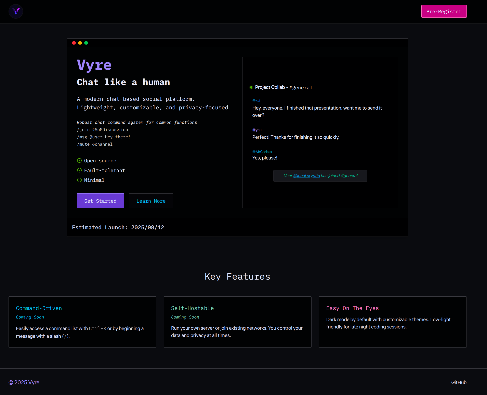

# Vyre

I've been increasingly frustrated with Discord as of late. So, I made my own!
The general idea is to create a chat application inspired by classic IRC client with the modern bells and whistles you're accustomed to.
It's built to be fast, secure, and easy to use without sacrificing scalability or cutting corners.

<!-- Check out the [Wiki](https://github.com/aileks/Vyre/wiki)! -->

### Feature Goals

- [x] User authentication & authorization
- [ ] User settings panel
- [ ] Chat commands list
- [ ] User statuses
- [ ] Real-time chat
- [ ] Chat commands
- [ ] Rich text support
- [ ] Group chats
- [ ] User profiles
- [ ] Notifications system
- [ ] Private messages
- [ ] Server admin panel
- [ ] Probably some other thing I'm forgetting...

### Project Stack

- **[Elixir](https://elixir-lang.org)**: functional, concurrent programming language built on the BEAM VM, chosen for scalability and fault tolerance.
- **[Phoenix Framework](https://www.phoenixframework.org)**: high-performance web framework for building real-time, maintainable applications.
- **Phoenix LiveView**: library for building dynamic, server-rendered UIs with real-time updates without client-side JavaScript.
- **Phoenix Channels**: realtime communication layer using WebSockets for bidirectional client-server interactions.
- **[Ecto](https://github.com/elixir-ecto/ecto)**: database wrapper and query generator for Elixir, enabling type-safe and composable database interactions.
- **HEEx Templates**: embedded HTML templating with Elixir integration for component-driven UI development.
